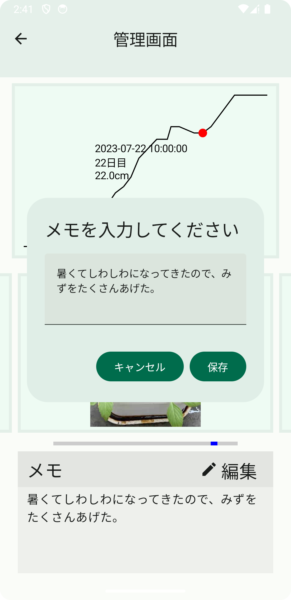

# 野菜の成長管理androidアプリ

- 育てる植物を追加して、写真とグラフで大きさを管理するアプリ

## UI実装

名前,説明,実装方法,プレビュー
植物追加ダイアログ,植物一覧画面に追加するダイアログ,テキストの下にカテゴリ選択メニューをつけることで、 植物の名前入力 -> カテゴリ選択 -> 登録までを一連の動作でできるように,
 
Preview
  

削除ボタン,削除機能,削除ボタンを押すと各セルの右端に削除ボタンを表示。タップすることで、チェックマークをつけて、選択していることがわかるように。  もう一度削除ボタンを押すことで削除できる,
 
Preview
  

カメラ,写真撮影,CameraXを使って実装した。カメラのプレビュー画面は、AndroidViewを使用しないと実装できなかった。カメラの撮影ボタンとキャンセルボタンは、ボトムバーを使って実装。  [苦労した点](#camerax),
 
Preview
   

植物の大きさ登録ダイアログ,撮影した植物の大きさを入力するダイアログ,少数以外が入力された場合は、テキストフィールドの下に警告表示と登録ボタンがタップできないようにしている。,
 
Preview
  

植物の大きさグラフ,植物の大きさをグラフとラベルで表示する。,Canvasを使ってグラフとテキストラベル・点を実装している。 テキストラベルは、点の位置でラベルの表示位置を変えており、どの位置にいてもラベルが見やすくするように実装している。,
 
Preview
  

画像表示カルーセル,管理画面での画像のスライド表示に使用。,画像のスクロール部分はPagerを使用して実装。画像下のバーは、画像の場所を表しており、タップすることで画像をタップ位置まで遷移させる。 DroidKaigiで説明していたカルーセルを追加改良して実装した(ボトムバータップによる画像スクロールアニメーションの追加)。,
 
Preview
 <video controls playsinline width="300dp" src="./others/coroucelMovie.webm" /> 

画像拡大モーダル,画像をタップしたときに、モーダルを表示して拡大表示機能の実装,モーダル内にもカルーセルを使って実装している。メイン画面とモーダル画面で同じものが表示できるように実装。, 上と同じ
メモ機能,編集ボタンを押すことで、メモ編集ダイアログを表示する。,メモが長くなっても全て表示できるように、本文のみスクロール可能なテキストを実装。,
 
Preview
 <video controls playsinline width="300dp" src="./others/manageMemoMovie.webm" />  

## 使用した技術

|名前           |説明          |
|---------------|--------------|
|MVVM           |アーキテクチャ|
|CameraX        |写真撮影      |
|Circle CI      |CI/CD         |
|JetPack Compose|UIアプリ開発  |
|ktlint         |フォーマッター|

### プログラムメモ

#### CameraX

JetPack Composeを使った実装事例が調べてもとても少なかったため、英語の記事を読むなどして実装した。  
カメラ画面はPreview(実際に撮影する画像のView)とボトムバーで構成されていて、ボトムバーは一般的なものに、キャンセルボタンにIcon、撮影ボタンにborderで丸型にしたBoxを使って実装した。
