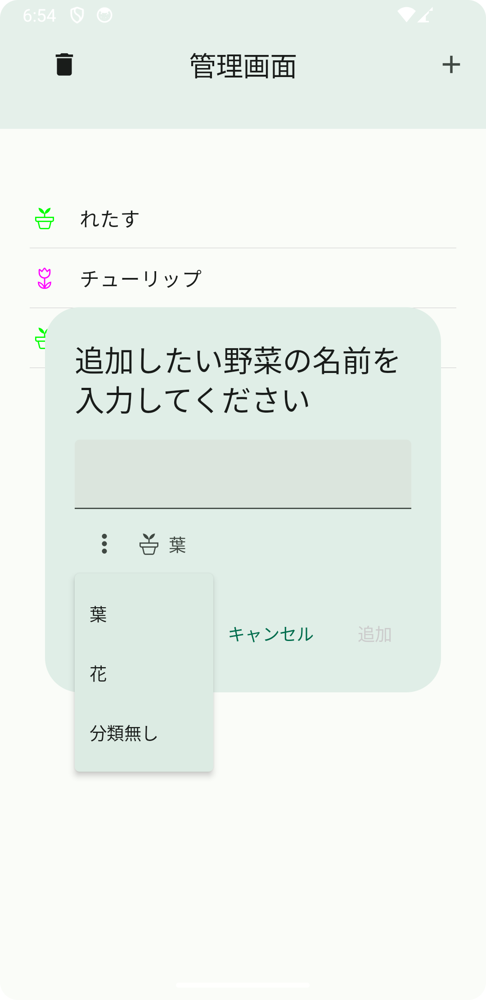
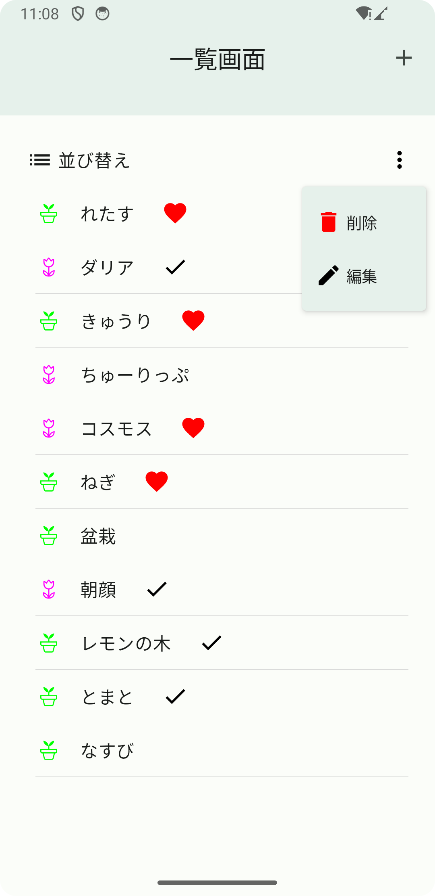
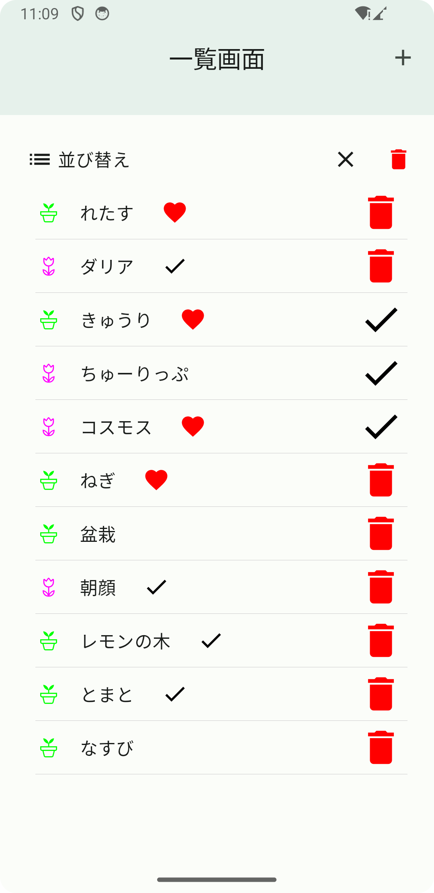
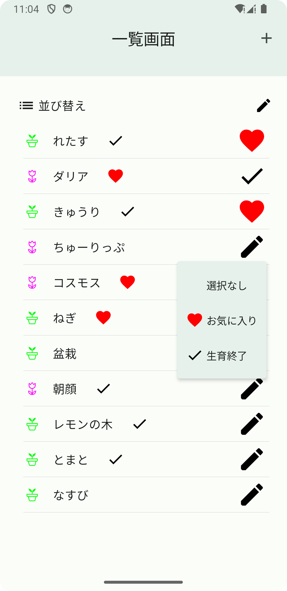
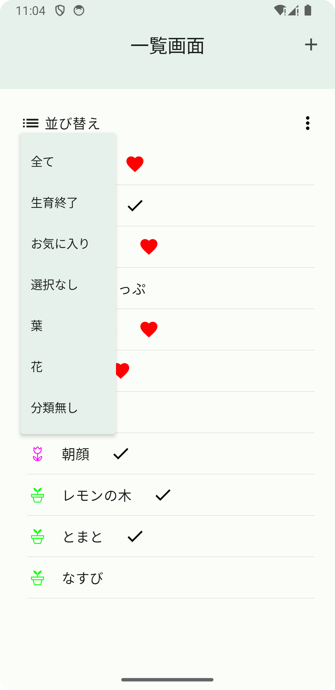
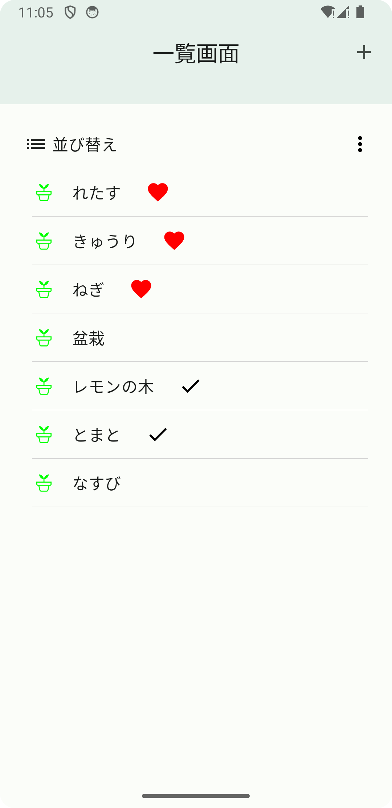
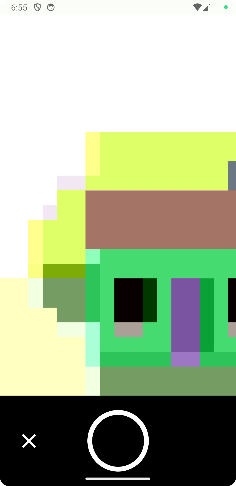
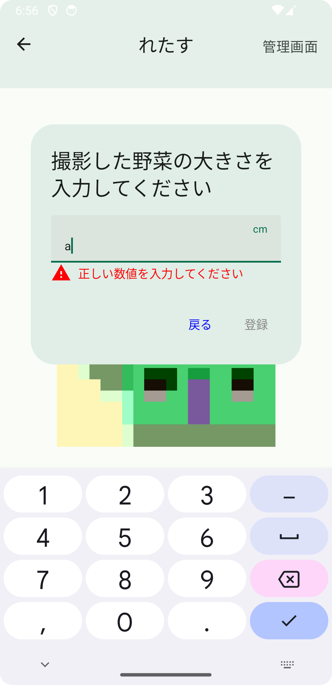
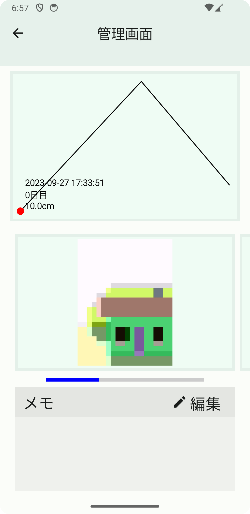

- [野菜の成長管理androidアプリ](#野菜の成長管理androidアプリ)
  - [開発背景](#開発背景)
  - [こだわりポイント](#こだわりポイント)
  - [デモ](#デモ)
  - [UI実装](#ui実装)
  - [使用した技術](#使用した技術)
    - [プログラムメモ](#プログラムメモ)
      - [CameraX](#camerax)
      - [カルーセル](#カルーセル)
# 野菜の成長管理androidアプリ

- 育てる植物を追加して、写真とグラフで大きさを管理するアプリ

  

## 開発背景

植物の目には見えない成長をグラフと写真で**可視化**することで野菜の成長を感じて、楽しく植物を育ててほしいと思い開発  
また、家庭菜園の場合は過去の栽培時に残したメモを見ながら試行錯誤をすることで、次の収穫量UPに繋ぐことができるアプリを作りたいと思った。

## こだわりポイント

長続きするポイントは、**登録するのがめんどくさいと感じない**ことだと考え、生育する植物の追加から、撮影・大きさ登録まで少ない動作で行うことができることを目指してデザイン・開発を行った。  
カテゴリ編集では、即時にカテゴリアイコンが変わるようにしているが、削除ではボタンを押してすぐ消すのではなく、もう一度押すことで消えるようにしている点。  
CI/CDツールであるCircleCIを取り入れることで、コードチェックとユニットテストを自動化した点。コードチェックを導入したことによって、最初は改行や空白がバラバラだったコードが、修正を繰り返す中でコードを綺麗に書けていると実感した。  

## デモ

ダリアのデータ(写真とグラフ・メモ)は、iOSアプリで記録したデータを使っています。
- 動画の構成
1. 植物の追加
2. 管理植物の並び替え
    - 全て --> 生育終了 --> お気に入り --> 花
3. トマトのステータスをお気に入りから生育終了へ編集
4. ダリアの成長管理閲覧
   1. グラフ・写真・メモの連動
   2. 画像下にあるボトムバーをタップしての移動
   3. 写真の拡大表示(モーダル表示)
   4. メモの編集

https://github.com/ghtoui/vegegrowth_android/assets/92294389/1546a1f2-d84f-4ddc-8b3a-05de72ffc704

## UI実装

|名前                      |説明                                                        |実装方法                                                                                                                                                                                                                                                   |プレビュー                                                                                                                                                                                                                    |
|--------------------------|------------------------------------------------------------|-----------------------------------------------------------------------------------------------------------------------------------------------------------------------------------------------------------------------------------------------------------|------------------------------------------------------------------------------------------------------------------------------------------------------------------------------------------------------------------------------|
|植物追加ダイアログ        |植物一覧画面に追加するダイアログ                            |テキストの下にカテゴリ選択メニューをつけることで、 植物の名前入力 -> カテゴリ選択 -> 登録までを一連の動作でできるように                                                                                                                                    |
 
Preview
  
                                                                                                                     |
|メニューボタン            |メニュー表示機能                                            |ボタンを押すと削除・編集ドロップメニューバーを表示する。どちらかを選択することで、アイコンが：からそれぞれに対応したアイコンに変化して、選択されているメニューの状態がわかる。                                                                             |
 
Preview
    選択状態でアイコンの変化は、下の削除ボタン・編集ボタンを参照 
                                                   |
|削除ボタン                |削除機能                                                    |削除ボタンを押すと各セルの右端に削除ボタンを表示。タップすることで、チェックマークをつけて、選択していることがわかるように。  もう一度削除ボタンを押すことで削除できる                                                                                     |
 
Preview
  
                                                                                                                    |
|編集ボタン                |編集機能                                                    |削除ボタンの編集版。タップすることでステータスのドロップメニューバーをメニューバーを表示して、ユーザに選択してもらう。選択すると、その選択したものに合わせてアイコンが変わる。                       |
 
Preview
  
                                                                                                                      |
|並び替えボタン            |植物カテゴリ、状態で表示を切り替えることができる。          |タップすることで、カテゴリと状態を選択できるドロップメニューバーを表示して、ユーザに選択してもらう。選択することで、リストの表示が切り替わる。                                                                                                             |このプレビューでは、葉を選択した状態になっている。   
 
Preview
   
|
|カメラ                    |写真撮影                                                    |CameraXを使って実装した。カメラのプレビュー画面は、AndroidViewを使用しないと実装できなかった。カメラの撮影ボタンとキャンセルボタンは、ボトムバーを使って実装。  [苦労した点](#camerax)                                                                  |
 
Preview
   
                                                    |
|植物の大きさ登録ダイアログ|撮影した植物の大きさを入力するダイアログ                    |少数以外が入力された場合は、テキストフィールドの下に警告表示と登録ボタンがタップできないようにしている。                                                                                                                                                   |
 
Preview
  
                                                                                                                   |
|植物の大きさグラフ        |植物の大きさをグラフとラベルで表示する。                    |Canvasを使ってグラフとテキストラベル・点を実装している。 テキストラベルは、点の位置でラベルの表示位置を変えており、どの位置にいてもラベルが見やすくするように実装している。                                                                             |
 
Preview
  
                                                                                                                     |
|画像表示カルーセル        |管理画面での画像のスライド表示に使用。                      |画像のスクロール部分はPagerを使用して実装。画像下のバーは、画像の場所を表しており、タップすることで画像をタップ位置まで遷移させる。 DroidKaigiで説明していたカルーセルを追加改良して実装した(ボトムバータップによる画像スクロールアニメーションの追加)。|
 
Preview
 <video controls width="300dp" src="https://github.com/ghtoui/vegegrowth_android/assets/92294389/e44af87b-95b9-46c3-994e-4932aeb07bc9" muted="false"></video> 
                  |
|画像拡大モーダル          |画像をタップしたときに、モーダルを表示して拡大表示機能の実装|モーダル内にもカルーセルを使って実装している。メイン画面とモーダル画面で同じものが表示できるように実装。                                                                                                                                                   |上と同じ                                                                                                                                                                                                                      |
|メモ機能                  |編集ボタンを押すことで、メモ編集ダイアログを表示する。      |メモが長くなっても全て表示できるように、本文のみスクロール可能なテキストを実装。                                                                                                                                                                           |
 
Preview
 <video controls width="300dp" src="https://github.com/ghtoui/vegegrowth_android/assets/92294389/d3995a3a-88f8-4f3f-a0eb-c4308f164b20" muted="false"></video> 
                  |

## 使用した技術

|名前           |説明                            |
|---------------|--------------------------------|
|MVVM           |アーキテクチャ                  |
|CameraX        |写真撮影                        |
|GitHub Actions |CI                              |
|JetPack Compose|UIアプリ開発                    |
|ktlint         |フォーマッター                  |
|ユニットテスト |Truth　　　　                   |
|Hilt           |依存性注入                      |
|Coil           |画像の読み込み                  |
|Room           |画像パスと登録野菜の詳細情報保存|
|Firebase       |分析                            |
|AdMob          |広告                            |

### プログラムメモ

#### CameraX

JetPack Composeを使った実装事例が調べてもとても少なかったため、英語の記事を読むなどして実装した。  
カメラ画面はPreview(実際に撮影する画像のView)とボトムバーで構成されていて、ボトムバーは一般的なものに、キャンセルボタンにIcon、撮影ボタンにborderで丸型にしたBoxを使って実装した。  
カスタマイズ可能なカメラ画面を作ることができて、撮影処理とキャンセル処理だけではなくて他の処理を拡張するのにも最適だと思った。例えば、トグルボタンをつけてONにして撮影すると撮影画像に登録した大きさや撮影日時を埋め込むなどの追加処理の拡張  

#### カルーセル

Pagerを使って実装する。現在地を表すボトムバーは、要素(このアプリではBox)を横並びにPagerの要素数だけ連続させることで実装できる。要素にonClickableを付与することで、このアプリで実装しているような画像スクロール機能が実装できる。  
カメラ画面はPreview(実際に撮影する画像のView)とボトムバーで構成されていて、ボトムバーは一般的なものに、キャンセルボタンにIcon、撮影ボタンにborderで丸型にしたBoxを使って実装した。  
Coilを使って実装済み。Coilを使わなければ、保存パスから画像を読み込み、Bitmapに変換して画像を表示する処理が必要だったが、Coilで簡単に実装することができた。  
